# SafeCast: Community Safety Platform

### Part 1: The Challenge & The Vision

---

## 🚨 The Problem Statement

**Why do critical safety warnings fail to reach the people who need them?**

In nearly every community—whether a school campus, a workplace, or a neighborhood—witnesses often see danger _before_ it escalates. However, valuable information rarely turns into immediate action due to three critical barriers:

- **🛑 The Barrier of Fear:** Witnesses hesitate to report incidents because they are afraid of exposing their identity, facing retaliation, or getting involved in complex bureaucracy.
- **📉 The Barrier of Noise:** Traditional alert systems blast everyone with every minor update. This causes "Alert Fatigue," where people stop paying attention to notifications because they assume it’s irrelevant.
- **⏳ The Barrier of Time:** In a crisis like a fire or an active threat, every second counts. Requiring users to create accounts, remember passwords, or navigate complex forms wastes precious time.

---

## 🛡️ The Platform Solution

**SafeCast / AlertaComunidad** bridges the gap between anonymous witnesses and immediate community safety.

It is a **Zero-Friction Safety Platform** designed to gather intelligence anonymously, verify it intelligently, and dispatch alerts instantly to the people who matter most.

### 🌟 Core Philosophy

We believe safety should be **Privacy-First** and **Community-Powered**.

- **Anonymous by Design:** Reporters never have to share their name, email, or phone number to send a warning.
- **Hyper-Local Relevance:** Alerts are not broadcast to the whole world; they are sent only to specific **Safety Circles** (e.g., "Library Staff" or "Dormitory B Residents"), ensuring that every notification is relevant and urgent.
- **Intelligent Verification:** Instead of relying on slow human reviews, the system uses an invisible "Trust Engine" to distinguish between genuine crises and malicious pranks in real-time.

### 🚀 How It Transforms Safety

| Traditional Reporting                   | The SafeCast Way                              |
| :-------------------------------------- | :-------------------------------------------- |
| **Slow & Bureaucratic** (Forms, Logins) | **Instant** (Scan QR Code & Type)             |
| **Identified** (Risks Retaliation)      | **100% Anonymous** (Protects Whistleblowers)  |
| **Unverified Noise** (Prone to Spam)    | **Smart Verification** (Filters Fake Reports) |
| **Generic Alerts** (Sent to Everyone)   | **Targeted Alerts** (Sent to Affected Zones)  |

# SafeCast: Community Safety Platform

### Part 2: The User Experience (The "Grand Loop")

The system is designed for speed. We removed every barrier that stops people from reporting danger.

---

## 🔗 Step 1: Establishing the Connection

**The Problem:** People don't download new apps for emergencies. 
**The Solution:** A lightweight, web-based subscription flow accessed via physical QR codes.

- **Frictionless Join:** Residents scan a QR code on a building wall. They are taken to a branded page for that specific **Safety Circle** (e.g., "Chicago Education Net").
- **Privacy-First:** They enter _only_ their WhatsApp number. No name, no password, no tracking.
- **Security:** The system uses an invisible captcha (Cloudflare Turnstile) to prevent SMS bot attacks.

> **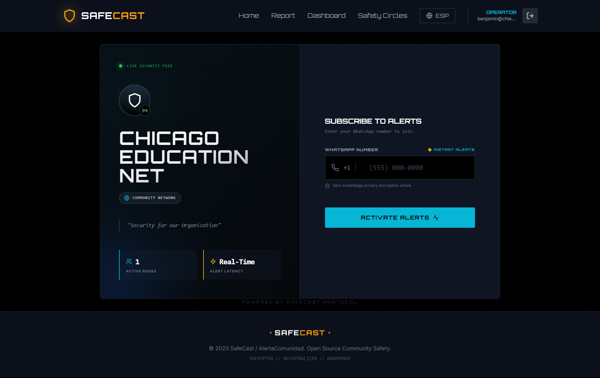** > _Caption: The mobile-optimized Join Page. Users confirm the circle name and enter their number to subscribe instantly._

---

## 📣 Step 2: Context-Aware Reporting

**The Problem:** In a panic, users forget where they are or type slowly. 
**The Solution:** "Smart" reporting links that do the work for them.

- **Auto-Location:** When a user scans a "Report" sticker in the _Science Library_, the report form opens with the **Circle Context** already pre-loaded in the system.
- **Smart Triage:** The user selects a Category (e.g., "Active Threat") and types a description.
- **Invisible Verification:** While they type, our **Trust Engine** silently analyzes their device fingerprint and connection to filter out pranksters.

> **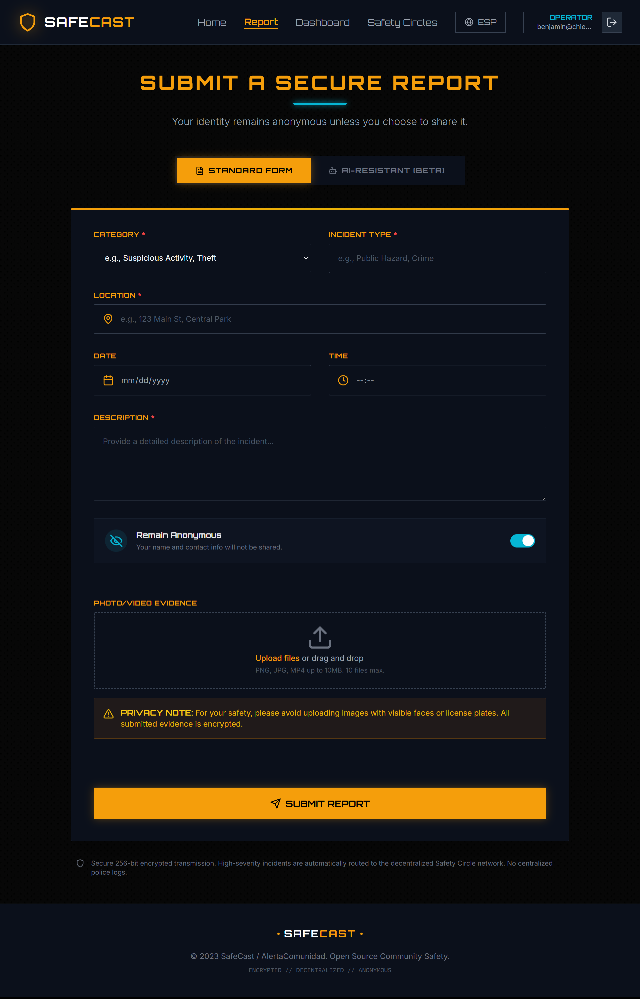**   **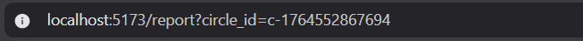** > _Caption: The Report Interface. Simple, bilingual, and context-aware. The system knows which Safety Circle is being alerted [uses Circle ID]._

---

## 📲 Step 3: The Premium Alert

**The Problem:** Generic SMS alerts are ignored. 
**The Solution:** Rich, actionable WhatsApp notifications.

If the report is verified as **High Severity** (by AI) and **High Trust** (by the Trust Engine), the system dispatches a premium alert immediately.

- **Visual Hierarchy:** Uses bold headers and emojis to cut through the noise.
- **One-Tap Safety:** Includes a **"Call Security"** button that instantly dials the specific emergency line for that facility.
- **Live Data:** Displays the exact Time, Location, and Incident Type.

> **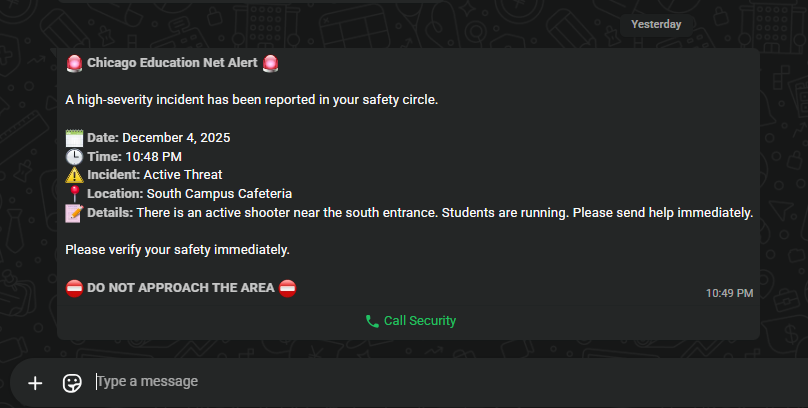** > _Caption: The final delivery. A clear, actionable warning sent to all subscribers of the affected Circle._

---

### Part 3: The Operator Command Center

While the public sees simplicity, the Safety Operators (Admins) have access to a powerful, data-rich dashboard to manage the crisis.

---

## 📊 The Operational Dashboard

**The Mission:** Total Situational Awareness.

The Dashboard is the first screen an Operator sees. It uses a **"Dark Mode / Cyberpunk"** aesthetic for high contrast in low-light control rooms.

- **RBAC Data Isolation:** Operators only see data for the Circles they manage. An operator for "School A" never sees data for "School B."
- **High-Risk Queue:** A dedicated sidebar (Red) allows operators to focus _only_ on active, unresolved threats.
- **Circle Filtering:** Operators managing multiple sites can toggle views (e.g., "Show only Downtown Campus") to reduce clutter.

> **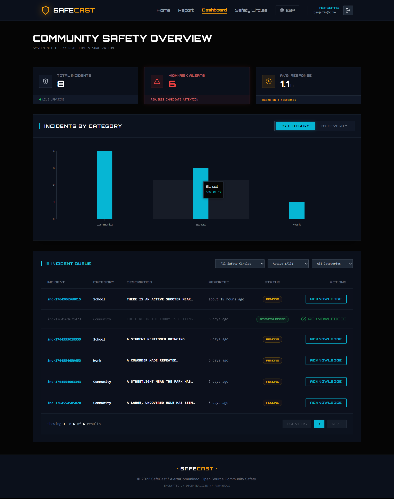**   **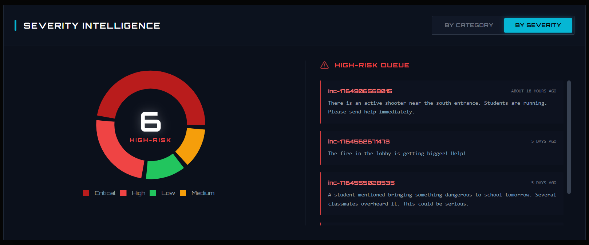**  > _Caption: The Operator Dashboard featuring real-time metrics, the High-Risk Queue, and Circle Filtering controls._

---

## 🛠️ Incident Management & Resolution

**The Mission:** Rapid Response and Closure.

Clicking an incident opens the **Tactical Detail View**. This is where the Operator works.

- **Trust Verification HUD:** A dedicated panel shows the **Trust Score** (e.g., "70/100 - High Credibility"). This tells the operator _why_ the system sent an alert.
- **Spam Defense:** If a report is fake, the Operator clicks **"BLOCK DEVICE"** to permanently ban that phone or that device from the network.
- **Lifecycle Management:**
  1.  **Acknowledge:** Marks the incident as "Under Investigation."
  2.  **Resolve:** Once the threat is neutralized, the Operator clicks **"MARK RESOLVED."** This archives the incident and removes it from the active dashboard.

> **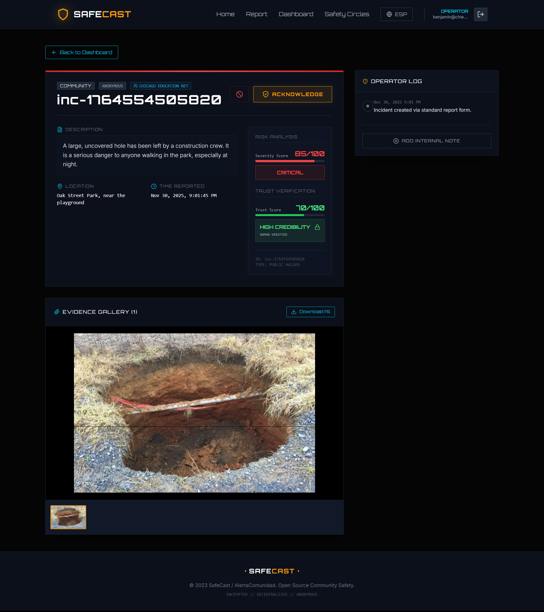** > **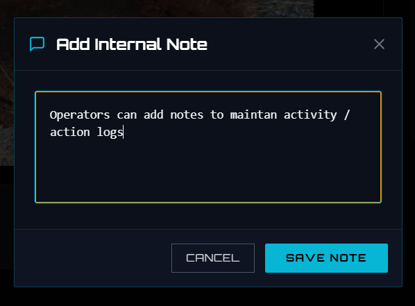** > **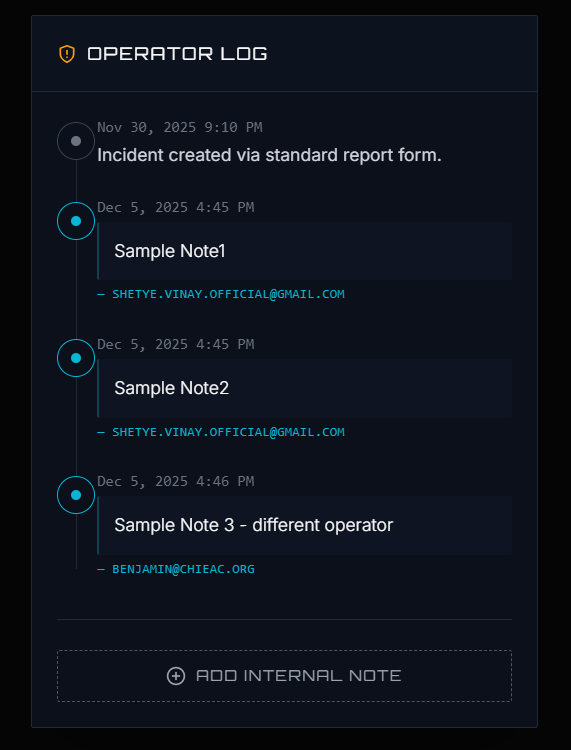** > _Caption: The Workstation view showing the Trust Score HUD, Evidence Gallery, and Resolution controls._

---

## 🌐 Network Growth: Safety Circles

**The Mission:** Scalable Deployment.

Operators can expand their safety net independently without IT support.

- **Self-Service Creation:** Operators create new circles (e.g., "Dormitory B Night Watch") in seconds.
- **Asset Generation:** The system automatically generates the **Invite Link** and **Reporting Link** for that circle.
- **QR Code Generator:** A built-in tool generates high-resolution QR codes ready for printing on stickers and posters.

> **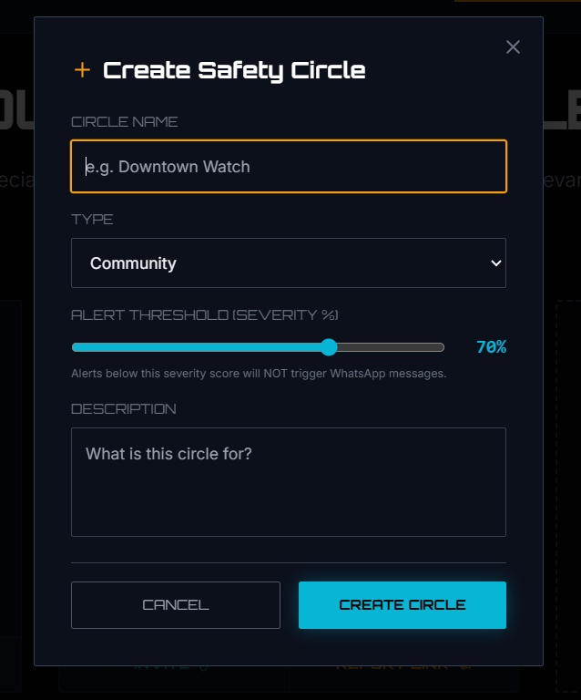**  **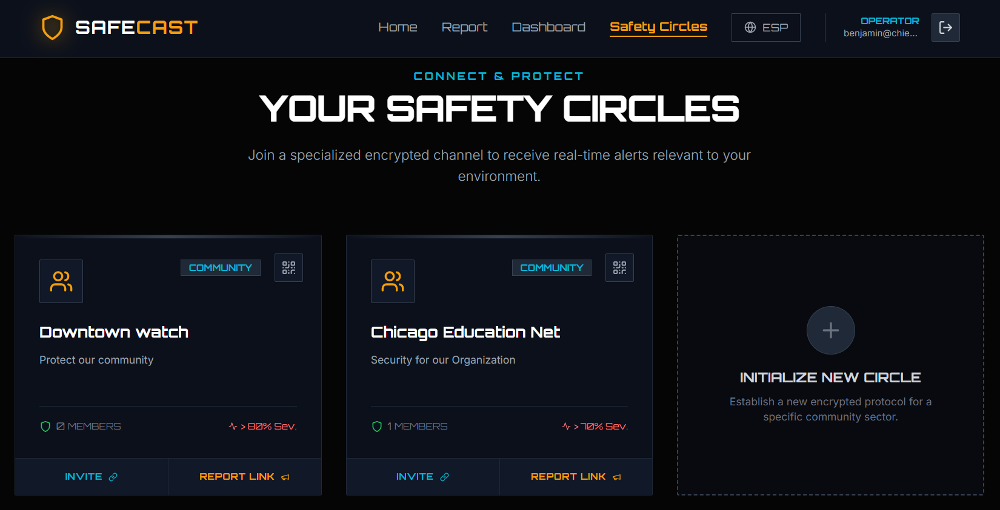** > _Caption: The Safety Circles management grid. Operators can create new networks and copy invite links instantly._

> **** > _Caption: The built-in QR Code generator, ready to print for physical deployment._

---

### Part 4: Administration & Governance

A robust system requires a robust chain of command. SafeCast implements a strict **Role-Based Access Control (RBAC)** hierarchy to ensure that only trusted individuals can manage sensitive safety networks.

---

## 🔑 The B2B Onboarding Flow

**The Mission:** Verify Trust Before Access.

Unlike public apps, operators cannot simply "sign up." They must be vetted.

1.  **Request Access:** Prospective organizations (e.g., a new school district) submit a formal **Partner Request** via a public portal.
2.  **Admin Review:** The Global Admin reviews the request, verifying the organization's identity.
3.  **Secure Approval:** Upon approval, the system auto-generates a secure, temporary credential set for the new Operator.

> **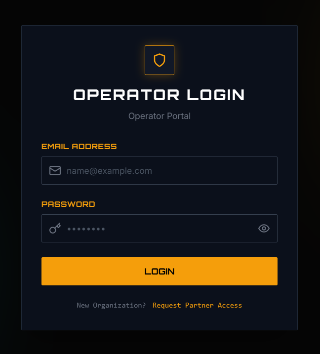** **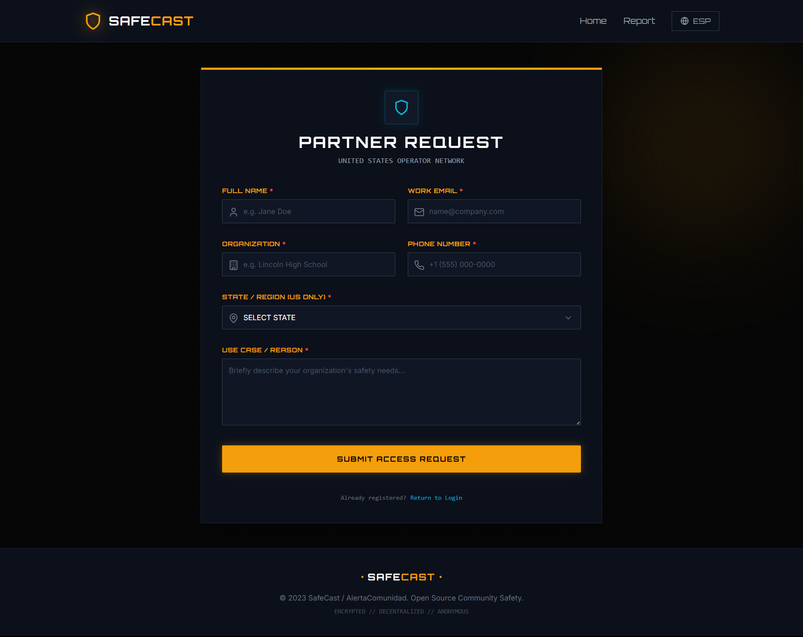**  > _Caption: The public Partner Request portal for new organizations._

> **** >  **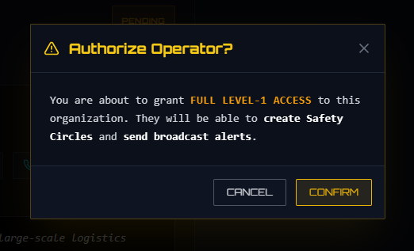**  >  **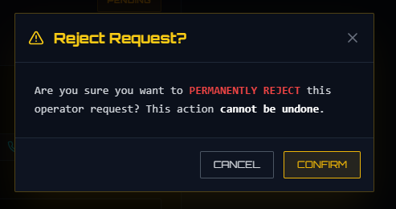**  >  **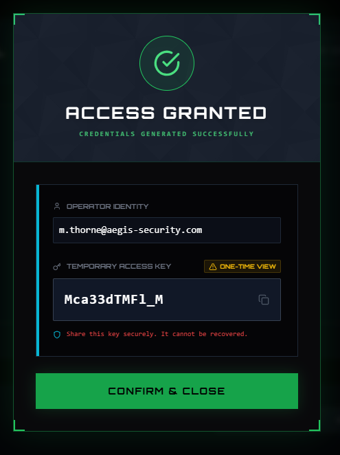**  > _Caption: The Admin Approval Panel. Super Admins can review, reject, or grant access with a single click._

---

## 🏛️ System Hierarchy

| Role                            | Responsibility                                                    | Access Level                             |
| :------------------------------ | :---------------------------------------------------------------- | :--------------------------------------- |
| **Global Admin** (Level 3)      | Technical Oversight, Operator Vetting, System Health.             | **Full Access** (All Data)               |
| **Regional Operator** (Level 2) | Managing Safety Circles, Handling Incidents, Broadcasting Alerts. | **Restricted Access** (Own Circles Only) |
| **Subscriber** (Level 1)        | Receiving Alerts via WhatsApp.                                    | **Read-Only** (via WhatsApp)             |
| **Reporter** (Public)           | Submitting Incidents via QR Code.                                 | **Write-Only** (Anonymous)               |

---

## 🧠 Extra: The AI Intelligence Layer

SafeCast is powered by a custom-trained Neural Classification Engine that runs in real-time on every report.

### 1. Incident Classification (NLP)

The system doesn't just read keywords; it understands **context**.

- **Scenario:** A user types _"The machine is sparking dangerously."_
- **AI Analysis:** The system identifies `Category: WORKPLACE` and `Type: HAZARD`.
- **Scenario:** A user types _"Some guy is following me and I'm scared."_
- **AI Analysis:** The system identifies `Category: COMMUNITY` and `Type: STALKING/HARASSMENT`.

### 2. Severity Scoring (0-100)

Every incident is assigned a numerical risk score. This score determines whether to wake up an Operator or trigger an automatic mass alert.

- **Low Risk (0-30):** Broken streetlights, noise complaints. -> **Log Only.**
- **High Risk (70-100):** Fires, Weapons, Active Threats. -> **Immediate Dispatch.**

> **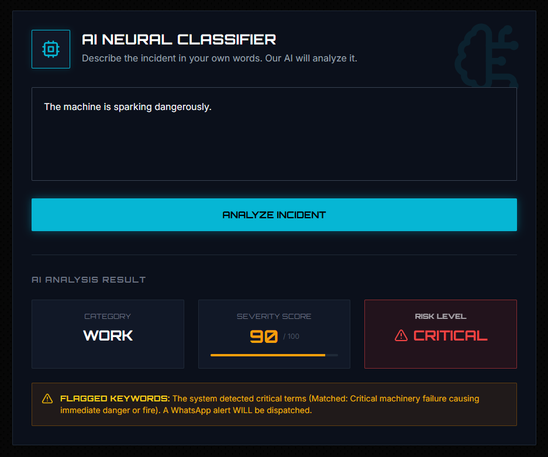**   **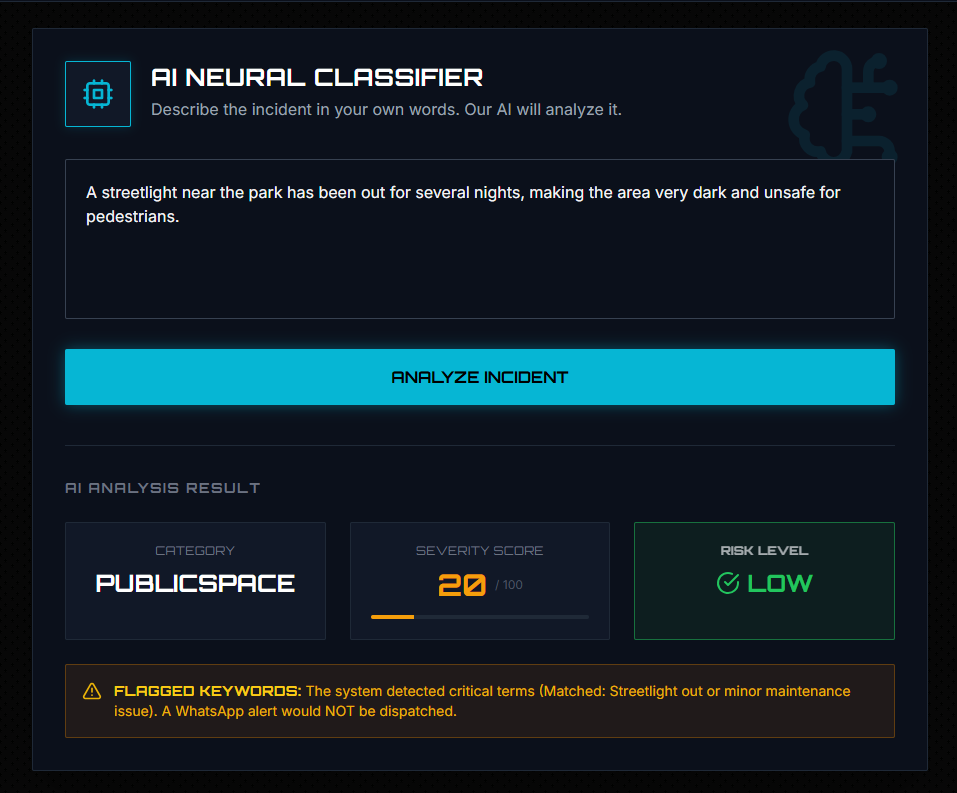**  > _Caption: The AI Neural Classifier interface demonstrating real-time analysis of a user's text input._

---

## 🛡️ Extra: Advanced Spam Defense Mechanics

To protect the community from panic caused by pranksters, SafeCast employs a multi-layered "Invisible Shield."

### 1. The "Shadow Ban" Protocol

When a malicious user (a bot or a known spammer) submits a report:

- **The User Sees:** A "Success" screen. They believe their prank worked.
- **The System Does:** **Silently discards** the report. It never reaches the database, never alerts the operator, and never sends a WhatsApp message.
- **Why?** By not showing an error, we prevent the attacker from realizing they are blocked, stopping them from trying to bypass the filter.

### 2. The "Anti-Nagging" Logic

What if a panicked user submits the same report 5 times in 1 minute?

- **Report 1:** **High Trust.** Alert Sent immediately.
- **Report 2-5:** The system recognizes the **Same Device ID** and **Same Context**.
- **Action:** The subsequent reports are saved as "Corroborating Updates" but **DO NOT** trigger new WhatsApp blasts. This prevents "Alert Fatigue" for subscribers while keeping the incident log accurate.

### 3. The "Crowd Surge" Validation

What if the Trust Score is borderline? The system looks for **Pattern Matching**.

- **Scenario:** 3 different devices report "Fire" within 2 minutes.
- **System Response:** Even if individual trust scores are medium, the **Volume** triggers a **Crisis Override**. The system elevates the threat level to **CRITICAL** and dispatches alerts instantly.

---

## 🔮 The Future Roadmap

The system is built on a modular microservices architecture, allowing for rapid expansion.

### Phase 1: Deployment (Immediate)

- **Containerization:** Deploying the Dockerized stack to a cloud provider (AWS/Railway) for 24/7 availability.
- **Beta Pilot:** Launching a live pilot at a single partner location to gather real-world feedback.

### Phase 2: Intelligence (Short Term)

- **Orphan Report Heatmaps:** Aggregating "Unlinked" reports to identify unsafe zones that need a new Safety Circle.
- **Operator Collaboration:** Allowing multiple operators to manage a single high-traffic circle (e.g., "Stadium Security Team").

### Phase 3: Integration (Long Term)

- **Mass Notification Systems:** Integrating with existing PA systems or digital signage APIs.
- **IoT Triggers:** Connecting to smart fire alarms or gunshot detectors for automated reporting.

---

## 🏁 Conclusion

SafeCast is not just an app; it is a **Protocol for Community Resilience**.

By removing the friction of reporting and automating the logic of verification, we have built a system that can react faster than humanly possible. It empowers communities to protect themselves, respecting privacy while demanding safety.

We are ready to launch soon!!!.

---
