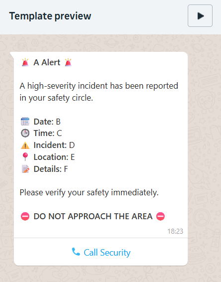

# 📱 WhatsApp Alerts Integration (SafeCast)

[]()
[]()
[]()

> **Documentation for setting up, testing, and deploying WhatsApp notifications for the SafeCast Alert System.**

---

## 📑 Table of Contents

- [Prerequisites](#-prerequisites)
- [Part 1: Account Setup](#-part-1-setting-up-meta-developer-account--whatsapp-business-app)
- [Part 2: Development & Testing](#-part-2-testing-whatsapp-alerts-development)
- [Part 3: Production Templates](#-part-3-creating-custom-message-templates-production)
- [Troubleshooting](#-troubleshooting)
- [Production Checklist](#-production-checklist)

---

## 🛠 Part 1: Setting Up Meta Developer Account & WhatsApp Business App

### Step 1: Verify Meta Developer Account

1. Navigate to [Meta for Developers](https://developers.facebook.com/).
2. Log in with your Facebook/Meta account.
3. Complete account verification (email and phone number are required).
4. Accept the Developer Terms of Service.

### Step 2: Create WhatsApp Business App

1. Go to **[My Apps](https://developers.facebook.com/apps)** and click **Create App**.
2. **Select Use Case:** Choose `Other` → Click "Next".
3. **Select App Type:** Choose `Business` → Click "Next".
4. **App Details:**
   - **App Name:** `SafeCast-Alerts` (or your preferred name)
   - **App Contact Email:** `your-email@example.com`
   - **Business Portfolio:** Select existing or create new.
5. Click **Create App**.

### Step 3: Add WhatsApp Product

From the App Dashboard:

1. Locate the **"Add Products"** section.
2. Find the **WhatsApp** product card.
3. Click **Set up**.
4. Follow the Meta prompts to finalize the API setup.

### Step 4: Access Developer Console

Navigate to **App Dashboard → WhatsApp → API Setup**.

Here you will find your critical development credentials:

- 🔑 **Temporary Access Token** (Valid for 24 hours)
- 📱 **Test Phone Number** (Sending number)
- 🆔 **Phone Number ID**
- 🆔 **WhatsApp Business Account ID**

> ⚠️ **CRITICAL NOTE:** The token provided here is temporary. For production, you **MUST** create a permanent System User Token. Please refer to the _Permanent Token Generation_ documentation.

---

## 🧪 Part 2: Testing WhatsApp Alerts (Development)

### 1. Configure Environment Variables

Ensure your `.env` file is populated with the credentials from the Developer Console:

```bash
WHATSAPP_API_TOKEN=your_temporary_token_here
WHATSAPP_PHONE_ID=your_phone_number_id
WHATSAPP_BUSINESS_ACCOUNT_ID=your_business_account_id
WHATSAPP_PORT=3002
TEST_WHATSAPP_RECIPIENT=15550000000  # Format: CountryCode + Number
```

### 2. Start the Application

Open your terminal and run the server:

```bash
npm run start:all
```

**Expected Output:**

> ✅ Server running on port 3002
> ✅ Firebase connection established
> ✅ Ready to accept requests

### 3. Send a Test Alert

Use `cURL` to trigger a manual test message.

**Command:**

```bash
curl -X POST http://localhost:3002/send-test \
     -H "Content-Type: application/json" \
     -d '{"to": "17744518623"}'
```

**Expected JSON Response:**

```json
{
  "message": "Test alert initiated."
}
```

_Check your physical device (WhatsApp) to verify the message receipt._

---

## 🚀 Part 3: Creating Custom Message Templates (Production)

### Why Templates?

The WhatsApp Business API enforces a **24-hour customer service window**. To send unsolicited alerts (like emergency warnings) outside of this window, you must use pre-approved **Message Templates**.

### Step 1: Access Template Manager

Go to: [WhatsApp Message Template Manager](https://business.facebook.com/wa/manage/message-templates/)
_(Or navigate via: Business Manager → WhatsApp Manager → Message Templates)_

### Step 2: Create New Template

Click **Create Template** and configure as follows:

| Field        | Value                                           |
| :----------- | :---------------------------------------------- |
| **Category** | `Utility` (Alerts, notifications)               |
| **Name**     | `high_risk_alert` (lowercase, underscores only) |
| **Language** | English (US)                                    |

#### Template Body Configuration

Enter the text below. Note the `{{variable}}` syntax:

```text
🚨 *{{1}} Alert* 🚨

A high-severity incident has been reported in your safety circle.

🗓️ *Date:* {{2}}
🕒 *Time:* {{3}}
⚠️ *Incident:* {{4}}
📍 *Location:* {{5}}
📝 *Details:* {{6}}

Please verify your safety immediately.

⛔ *DO NOT APPROACH THE AREA* ⛔
```

<br>

****

#### Interactive Button (Optional)

- **Type:** URL
- **Text:** View Dashboard
- **URL:** `https://your-dashboard-url.com`

### Step 3: Approval & Testing

1. Click **Submit**. Meta usually reviews templates within 1-24 hours.
2. Once the status changes to **Approved** ✅, you may test it via the API:

```bash
curl -X POST http://localhost:3002/send-alert \
     -H "Content-Type: application/json" \
     -d '{
       "to": "15551234567",
       "type": "Fire",
       "location": "Main Library Lobby"
     }'
```

---

## 🔧 Troubleshooting

### ❌ Error: "Template not found"

- **Cause:** The template name in the code does not match the Meta Manager exactly, or the template has not been approved yet.
- **Fix:** Ensure the name is exactly `high_risk_alert` and status is green/approved.

### ❌ Error: "Invalid phone number"

- **Cause:** Incorrect formatting.
- **Fix:** Do not use `+` symbols or dashes. Use the format: `[CountryCode][Number]`.
  - _Correct:_ `14155551234`
  - _Incorrect:_ `+1-415-555-1234`

### ❌ Error: "Token expired"

- **Cause:** You are using the 24-hour dev token and the time limit has passed.
- **Fix:** Generate a new temporary token for testing, or switch to the System User Token for production.

---

## ✅ Production Checklist

Before going live, ensure the following steps are complete:

- [ ] **Permanent Token:** Generated System User Token (replaced 24h dev token).
- [ ] **Official Number:** Registered official business phone number (migrated from test number).
- [ ] **Profile:** Verified business profile logo, description, and display name.
- [ ] **Templates:** All required message templates are created and **Approved**.
- [ ] **Webhooks:** (Optional) Set up webhooks to handle incoming replies.
- [ ] **Environment:** Production `.env` variables configured.
- [ ] **Policy:** Reviewed [WhatsApp Business Policy](https://www.whatsapp.com/legal/business-policy/) to ensure compliance.
